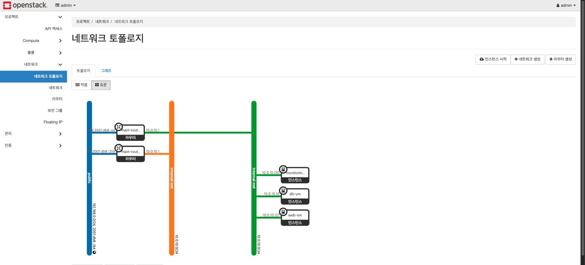

<!--
README 템플릿 — 채우는 방법
─────────────────────────────────────────────────────────────────────────────
이 주석 블록과 각 섹션의 <!-- 가이드 --> 주석은 작성이 끝나면 전부 지운다.

원칙 3가지 (2026년 기준 잘 쓴 개인 프로젝트 README의 공통점):
  1. 스크롤 1~2회 안에 "뭘 만들었고 어떻게 재현하는지"가 끝난다.
  2. 그림이 문단보다 먼저 온다. 인프라 프로젝트는 아키텍처 도식이 첫 화면에.
  3. 자랑보다 판단. "무엇을 했다"보다 "왜 그렇게 했다 / 무엇을 포기했다"가 읽힌다.

문장 톤: 1인칭 없이 담백하게. 형용사보다 숫자와 사실.
  ✗ "다양한 트러블슈팅을 경험하며 성장했습니다"
  ✓ "설치 과정에서 장애 11건을 기록했다. 가장 오래 걸린 것은 #5(2시간)."
─────────────────────────────────────────────────────────────────────────────
-->

# <!-- 프로젝트 이름 --> OpenStack Private Cloud on a Single PC

<!-- 한 줄 소개. 이 한 문장만 읽고 나가는 사람이 대부분이다.
     "무엇을 + 어디에 + 무엇으로" 형태를 권장.
     예: PC 한 대에 DevStack으로 프라이빗 클라우드를 구축하고, Terraform으로 2-tier 웹 서비스를 배포한 학습 프로젝트. -->

## 아키텍처


<!-- 그림 아래 2~3줄. 그림이 말하지 않는 것만 적는다.
     예: 물리 서버 1대(16GB RAM) 위의 all-in-one 구성. 집 LAN을 OpenStack의 외부 네트워크로
         그대로 사용해, 노트북에서 Floating IP로 서비스에 접속한다. -->

## 왜 만들었나

<!-- 이 프로젝트의 목표를 그대로 쓰면 된다:
     OpenStack의 전반적인 사용 방법(설치, 셋업, VM 생성, VM에 서비스 배포)을 학습하기 위해
     Local PC에 DevStack으로 프라이빗 클라우드 환경을 구축하고 간단한 서비스를 배포한다.

     여기에 "문서로 읽는 것과 직접 굴려보는 것의 차이"를 한 줄 덧붙이면 뒤의 트러블슈팅
     섹션과 이어진다. -->

## 스택

| 영역 | 사용 |
|---|---|
| 클라우드 | DevStack `stable/2025.1` (all-in-one) |
| 호스트 | Ubuntu 22.04 LTS · 16GB RAM · vCPU 8 · NIC 1개 |
| IaC | Terraform ≥ 1.5 · provider `terraform-provider-openstack/openstack ~> 3.0` |
| VM 초기화 | cloud-init |
| 서비스 | Flask + MySQL 8.0 (2-tier 게시판) |
| 모니터링 | Prometheus · Grafana · node_exporter · openstack-exporter |
| 형상관리/CI | GitLab CE(로컬) — fmt / tflint / validate / tfsec |

## 구성

| 리소스 | 내용 |
|---|---|
| `internal-net` | `10.0.10.0/24` + `main-router` (외부 게이트웨이 = 집 LAN) |
| `web-vm` | Flask 게시판 `:80`, Floating IP 있음 |
| `db-vm` | MySQL on Cinder 볼륨 10GB, 고정 IP `10.0.10.10`, **Floating IP 없음** |
| `monitoring-vm` | Prometheus `:9090` · Grafana `:3000` · openstack-exporter, Floating IP 있음 |
| Security Group | `web-sg`(LAN → 22/80) · `db-sg`(**web-sg → 3306만**) · `monitoring-sg` |

<!-- 이 표에서 자랑할 지점은 db-vm 행이다. "Floating IP 없음"과 "web-sg에서만 3306"이
     private 경계를 만든 설계 판단이므로, 한 줄로 짚어주면 좋다. -->

## 재현 방법

```bash
# 1. DevStack 설치 — docs/01-devstack.md 참조 (로컬 콘솔에서만, 30~60분)
#    local.conf 작성 → ./stack.sh

# 2. Terraform 적용
cp terraform.tfvars.example terraform.tfvars   # 이미지 경로·비밀번호 기입
terraform init
terraform apply

# 3. 접속
terraform output web_floating_ip               # http://<이 값>/  → 게시판
terraform output grafana_url                   # 모니터링 대시보드
```

<!-- 사전 조건(호스트 사양, Ubuntu 버전, KVM 지원)은 docs/01-devstack.md로 넘기고
     여기서는 명령만 남기는 편이 읽기 좋다. -->

## 결과

<!-- 스크린샷 2~3장. docs/images/ 에서 고른다. 추천 조합:
     게시판 화면(서비스가 돈다) + 네트워크 토폴로지(구조) + Grafana(운영).
     각 이미지 아래 한 줄 캡션. -->




## 겪은 문제 3가지

<!-- 이 섹션이 이 프로젝트의 차별점이다. 장애 11건을 원문 에러와 함께 기록해 뒀다.
     전부 나열하지 말고 3건만 한 줄씩 — 나머지는 링크로 보낸다.
     고르는 기준: "원인이 예상 밖이었던 것". 추천 3건:

     - #5 br-ex가 공유기 IP를 사칭해 서버 아웃바운드가 전면 차단 (LAN은 되는데 인터넷만 죽음)
     - #3 클린 재설치 후에도 같은 503 — 초기화를 빠져나간 좀비 프로세스가 진범
     - #11 GitLab의 IaC가 실환경과 달랐다 — 문서에서 복원한 코드는 원본이 아니다

     각 줄에 "무엇이 → 왜"까지 압축해 쓰면 클릭을 부른다. -->

전체 기록: [docs/troubleshooting.md](docs/troubleshooting.md)

## 한계와 다음 단계

| 한계 | 표준 방식 |
|---|---|
| Flask `app.run()`을 root로 80 포트 직접 구동 | gunicorn/uWSGI + nginx, 비특권 유저 |
| tfstate 로컬 파일 | Swift/S3 원격 백엔드 + 잠금 |
| `terraform.tfvars`·`user_data` 평문 비밀번호 | Vault / SOPS |
| 모니터링이 감시 대상 클라우드 안에 위치 | 별도 서버에 분리 (단일 노드에서는 구조적으로 불가) |
| exporter 계정이 `admin` 권한 | 최소 권한 롤 + 정책 조정 |
| 단일 노드 all-in-one | 컨트롤러/컴퓨트/네트워크 노드 분리, HA |

<!-- 한계를 먼저 적는 것이 유리하다. 읽는 사람이 어차피 찾아낼 것을 먼저 말하면
     "알고 남겨뒀다"가 되고, 말하지 않으면 "몰랐다"가 된다.
     각 항목을 왜 그대로 뒀는지(검증 환경 부재, 범위 밖 등) 한 줄 덧붙여도 좋다. -->

## 문서

| | |
|---|---|
| [1. DevStack 설치](docs/01-devstack.md) | 사전 확인, `local.conf`, 설치와 검증 |
| [2. 인프라 구성과 IaC 전환](docs/02-infrastructure.md) | CLI 수동 구축 → Terraform + cloud-init |
| [3. 모니터링](docs/03-monitoring.md) | 테넌트/오퍼레이터 두 시야, 설계 판단과 한계 |
| [4. 형상관리와 CI](docs/04-ci.md) | 로컬 GitLab CE + 검사 파이프라인 4종 |
| [5. 검증](docs/05-verification.md) | 동작 확인과 화면 |
| [트러블슈팅 기록](docs/troubleshooting.md) | 장애 11건, 에러 원문 포함 |

<!-- 선택 섹션 — 필요하면 추가:
     - 라이선스: 개인 학습 프로젝트라 생략해도 무방
     - 연락처/포트폴리오 링크: 채용 목적이면 맨 아래 한 줄
     넣지 말 것: Contributing 가이드, Code of Conduct, 뱃지 도배. 1인 프로젝트에는 노이즈다. -->
