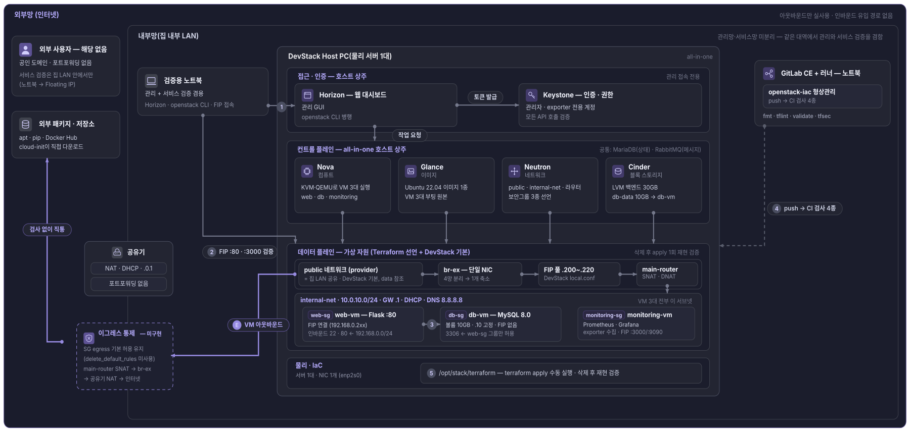
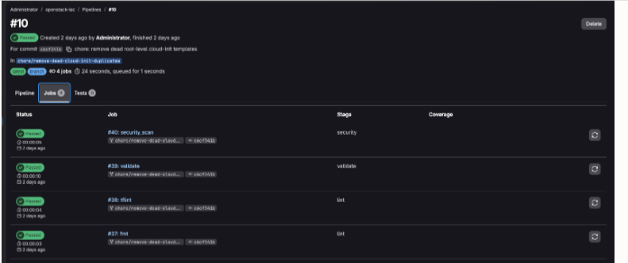

## Architecture



**All In One 호스트 구성** — Local PC 1대에 DevStack으로 OpenStack 핵심 컴포넌트(Keystone · Nova · Neutron · Glance · Cinder · Horizon)를 설치하고, 이 컴포넌트들로 VM 3대를 운영하도록 구성했다.

**내부망 구성** — 공유기에 포트 포워딩을 설정하지 않아 외부에서 유입되는 경로 자체가 존재하지 않으며, 접근은 같은 LAN 안에서만 가능하다. 또한 공유기의 DHCP 할당 범위를 `192.168.0.2~199`로 제한해, DevStack이 사용할 Floating IP Pool(`.200~.220`)과 IP가 겹치지 않도록 구성했다.

**서비스 구성** — VM 3대(web · db · monitoring)를 DevStack으로 구성한 Internal Net(`10.0.10.0/24`) 위에 배치했다. web-vm과 monitoring-vm은 Floating IP를 부여해 LAN에서 접근할 수 있게 했고, db-vm은 Floating IP 없이 출발지를 web-sg 그룹으로만 허용해 web-vm에서 내부 네트워크를 통해서만 접근하도록 격리했다.

**IaC · 형상관리** — DevStack 자원의 생성과 변경은 Terraform으로 선언해 코드 단위로만 실행되도록 구성했고, VM에서 호스팅되는 서비스(MySQL · Flask · Prometheus · Grafana)는 cloud-init을 통해 배포되게 구성했다. 형상관리와 검증은 노트북의 GitLab CE가 맡아 push마다 CI 검사 4종(fmt · tflint · validate · tfsec)을 수행하며, 전체 자원을 삭제한 뒤 `terraform apply` 1회로 동일 환경이 재생성되는 것을 검증했다.

## Why

DevStack을 사용해 Local 환경에서 노트북과 PC를 통해 Private Cloud를 구축하며 OpenStack의 기초적인 내용들을 학습하기 위한 프로젝트이다.
물리 서버 1대에 DevStack 기반 all-in-one Private Cloud를 구축하고, 외부 공개 없이 LAN에서만 접근할 수 있는 아키텍처로 cloud의 VM에 간단한 게시판 서비스 배포 · 운영을 목표로 설정하였다.

## Repository Structure

```
.
├── version.tf                        # Terraform·provider 버전
├── providers.tf                      # DevStack 접속 정보
├── variables.tf                      # 입력 변수 정의
├── terraform.tfvars.example          # 변수 값 예시
│
├── network.tf                        # 내부 네트워크·라우터·Floating IP
├── security.tf                       # 방화벽 규칙 (Security Group)
├── compute.tf                        # web-vm·db-vm 생성
├── storage.tf                        # DB용 볼륨 10GB
├── monitoring.tf                     # monitoring-vm 생성
├── identity.tf                       # 모니터링 전용 계정
├── outputs.tf                        # 접속 주소 출력
│
├── templates/                        # VM 부팅 시 자동 설치 스크립트 (cloud-init)
│   ├── web-init.yaml.tftpl           # Flask 게시판
│   ├── db-init.yaml.tftpl            # MySQL + 볼륨 마운트
│   └── monitoring-init.yaml.tftpl    # Prometheus·Grafana
│
├── .gitlab-ci.yml                    # push마다 Terraform 코드 검사
└── docs/                             # 구축 문서와 트러블슈팅 기록
```

## Results


web-vm에 배포한 게시판 서비스


Prometheus Dashboard


Grafana Dashboard (하이퍼바이저·인스턴스 상태 시각화)



LAN 내부에서만 접근 가능한 GitLab

## TroubleShooting

[docs/troubleshooting.md](docs/troubleshooting.md)

## Documentation

| | |
|---|---|
| [1. DevStack 설치](docs/01-devstack.md) | 사전 확인, `local.conf`, 설치와 검증 |
| [2. 인프라 구성과 IaC 전환](docs/02-infrastructure.md) | CLI 수동 구축 → Terraform + cloud-init |
| [3. 모니터링](docs/03-monitoring.md) | 테넌트/오퍼레이터 두 시야, 설계 판단과 한계 |
| [4. 형상관리와 CI](docs/04-ci.md) | 로컬 GitLab CE + 검사 파이프라인 4종 |
| [5. 검증](docs/05-verification.md) | 동작 확인과 화면 |
| [트러블슈팅 기록](docs/troubleshooting.md) | 장애 11건, 에러 원문 포함 |
