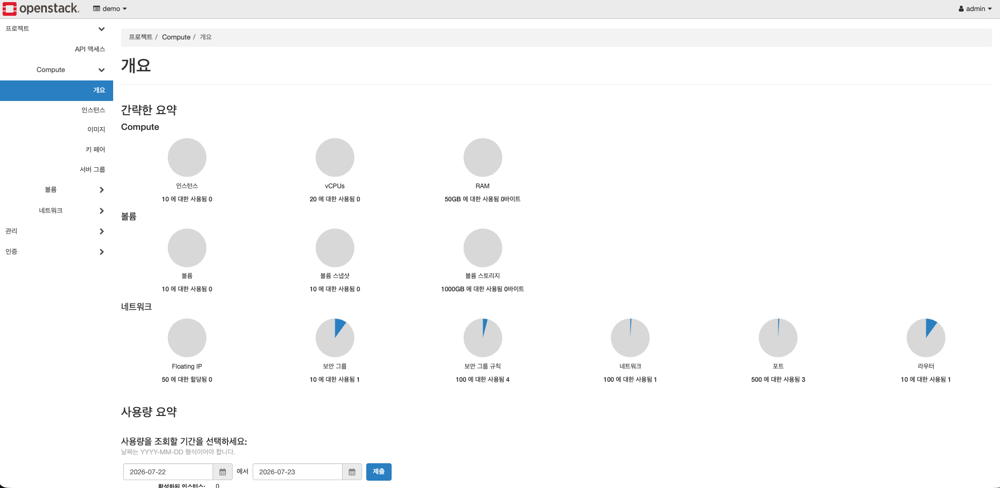

# 1. DevStack 설치 — PC 한 대를 미니 데이터센터로

OpenStack을 문서로 읽는 것과 직접 굴려보는 것은 다르다. 이 문서는 PC 한 대에
OpenStack을 통째로 올리는 과정과, 그 과정에서 왜 각 설정이 그렇게 되어야 하는지를 다룬다.

**DevStack**은 OpenStack의 핵심 컴포넌트를 한 대의 머신에 자동으로 설치·설정해 주는
공식 스크립트다. 프로덕션용이 아니라 개발·학습용이며, 그래서 학습에 적합하다.

| 컴포넌트 | 역할 |
|---|---|
| Keystone | 인증 — 모든 API 요청의 로그인/권한 |
| Nova | VM 생성·관리 |
| Neutron | 가상 네트워크·라우터·방화벽 |
| Glance | VM의 원본 OS 이미지 보관 |
| Cinder | VM에 붙이는 블록 스토리지 |
| Horizon | 웹 대시보드 |

이 문서의 절차는 전부 [`scripts/00-precheck.sh`](../scripts/00-precheck.sh)와
[`scripts/01-install-devstack.sh`](../scripts/01-install-devstack.sh)에 코드로 들어 있다.
아래는 그 스크립트가 무엇을 왜 하는지에 대한 설명이다.

---

## 1.1 사전 점검

설치는 30~60분 걸린다. 조건 미달을 설치 도중이나 설치 후에 발견하면 그 시간을 통째로 잃는다.

```bash
./scripts/00-precheck.sh
```

**하드웨어** — OpenStack은 "PC 안에 가상 컴퓨터를 여러 대 만드는" 소프트웨어다.

| 항목 | 기준 | 왜 |
|---|---|---|
| RAM | 16GB 이상 | VM 3대(각 2GB) + DevStack 서비스 자체 |
| 루트 여유 공간 | 60GB 이상 | DevStack 소스 + 이미지 + Cinder 백킹 파일 30GB |
| CPU 가상화 | vmx(Intel) / svm(AMD) | 없으면 소프트웨어 에뮬레이션으로 돌아 못 쓸 만큼 느리다 |
| kvm 커널 모듈 | 로드됨 | 지원과 별개로 모듈이 실제로 올라와 있어야 한다 |
| OS | Ubuntu 22.04 LTS | DevStack 공식 지원 대상 |

kvm은 리눅스에 내장된 가상화 엔진이다. OpenStack(정확히는 Nova)이 VM을 만들 때 실제로
일을 하는 건 kvm이다.

**네트워크** — 스크립트가 자동 감지하지만, 값의 의미는 알고 있어야 한다.

이 구성의 뼈대는 **집 LAN(192.168.x.0/24)을 OpenStack의 "외부 네트워크"로 그대로 쓰는 것**이다.
그래서 VM에 부여하는 Floating IP가 곧 집 LAN상의 IP가 되고, 같은 LAN의 노트북에서 브라우저로
바로 접속할 수 있다.

스크립트가 확인할 수 없어 직접 봐야 하는 것 세 가지:

- **공유기 DHCP 할당 범위와 Floating IP 범위가 겹치지 않는가.** 겹치면 스마트폰이 받아간 IP를
  VM도 쓰겠다고 나서서 충돌한다. DHCP가 `.2~.199`라면 Floating IP는 `.200~.220` 식으로.
- **호스트 PC에 MAC 기반 고정 IP(DHCP reservation)를 걸었는가.** 재부팅마다 IP가 바뀌면
  설정 파일과 실제가 어긋나 전부 깨진다.
- **공유기의 "AP 격리"가 꺼져 있는가.** 켜져 있으면 마지막 검증에서 노트북 → VM 접속이 안 되는데
  원인을 찾기가 매우 어렵다. 노트북에서 `ping <호스트IP>`가 되면 OK.

---

## 1.2 설치

```bash
sudo ./scripts/01-install-devstack.sh
```

> ⚠️ **SSH로 실행하지 말 것.** 설치 중 `PUBLIC_INTERFACE`로 지정한 랜카드가 가상 스위치
> br-ex에 편입되는 순간 호스트 네트워크가 끊긴다. 원격 접속이라면 그 자리에서 설치가 중단된다.
> PC 앞에 앉아 로컬 콘솔에서 실행할 것. 스크립트도 시작 전에 이 경고를 띄우고 확인을 받는다.

스크립트가 하는 일:

**① stack 유저 생성.** stack.sh는 root가 아닌 일반 유저로 실행하도록 설계돼 있다. root로
실행하면 중간에 권한 문제로 실패한다. 그래서 홈이 `/opt/stack`인 전용 유저를 만들고,
설치 중 필요한 관리자 권한은 비밀번호 없이 sudo로 쓰게 해 준다.

**② stable 브랜치 클론.** 기본값인 master는 OpenStack 개발자들이 실시간으로 고치는 브랜치라
받는 시점에 따라 그냥 깨져 있다. 이 구성은 `stable/2025.1`로 고정했다.
(설치 전 <https://releases.openstack.org>에서 현재 maintained 상태인 릴리스를 확인할 것.
`DEVSTACK_BRANCH` 환경변수로 바꿀 수 있다.)

**③ `local.conf` 렌더.** `local.conf`는 DevStack의 **유일한 설정 파일**이다. 여기에 몇 줄만
적으면 stack.sh가 나머지 수백 개 설정을 알아서 채운다. 템플릿은
[`scripts/local.conf.template`](../scripts/local.conf.template).

```ini
ADMIN_PASSWORD=secret                 # Horizon/CLI 관리자 로그인
DATABASE_PASSWORD=...                 # 내부 MariaDB
RABBIT_PASSWORD=...                   # 내부 메시지 큐
SERVICE_PASSWORD=...                  # 각 컴포넌트가 Keystone에 로그인할 때

HOST_IP=192.168.0.67                  # 이 PC의 고정 IP
PUBLIC_INTERFACE=enp2s0               # 실제 NIC 이름
FLOATING_RANGE=192.168.0.0/24         # "외부 네트워크" = 집 LAN 전체
Q_FLOATING_ALLOCATION_POOL=start=192.168.0.200,end=192.168.0.220   # VM에 나눠줄 범위
PUBLIC_NETWORK_GATEWAY=192.168.0.1    # 공유기 IP

GIT_BASE=https://opendev.org          # 기본 GitHub보다 안정적
VOLUME_BACKING_FILE_SIZE=30G          # Cinder가 볼륨을 만들 때 쓸 공간
```

**④ `local.sh` 배치.** stack.sh가 설치 마지막에 자동 실행하는 훅이다. 여기에 br-ex 게이트웨이
사칭을 상쇄하는 한 줄을 넣는다 — 아래 참조.

**⑤ `stack.sh` 실행.** 30~60분.

### PUBLIC_NETWORK_GATEWAY의 함정

이 구성에서 가장 오래 잡고 있었던 문제다.

DevStack은 `PUBLIC_NETWORK_GATEWAY`로 지정한 IP를 **br-ex 인터페이스에 직접 부여한다.**
원래 이 옵션은 가짜 public 대역(기본 172.24.4.0/24)의 실존하지 않는 게이트웨이를 호스트가
대신 맡는 용도다. 그런데 이 구성처럼 **실존하는 공유기 IP**를 지정하면 서버가 자기 자신을
게이트웨이로 인식하게 되고, 기본 라우트로 나가는 모든 패킷이 공유기가 아닌 로컬 br-ex로
회귀한다 → **호스트 아웃바운드 전면 차단**.

LAN 내부 통신은 게이트웨이를 안 거치므로 멀쩡해서, "LAN은 되는데 인터넷만 안 되는" 비대칭
장애로 나타난다. 알아채기가 매우 어렵다.

집 LAN을 public 네트워크로 쓰는 아이디어가 치르는 대가이고, 구성 자체는 유지하되 부작용만
상쇄하는 것이 정답이다. `local.sh`에 이 한 줄을 넣으면 stack.sh를 다시 돌려도 매번 자동으로
상쇄된다.

```bash
sudo ip addr del 192.168.0.1/24 dev br-ex 2>/dev/null || true
```

자세한 진단 과정은 [troubleshooting #5](troubleshooting.md#5-br-ex가-공유기-ip를-사칭하여-서버-아웃바운드-전면-블랙홀).

---

## 1.3 설치 확인

```bash
sudo -u stack -i
source /opt/stack/devstack/openrc admin admin   # admin 인증 정보를 현재 셸에 로드
openstack service list      # keystone/nova/neutron/glance/cinder/placement가 보이면 정상
openstack hypervisor list   # 이 PC가 VM을 돌릴 하이퍼바이저로 등록됐는지
```

브라우저에서 `http://<HOST_IP>/dashboard` (Horizon) 로그인. 같은 LAN의 다른 기기에서도
같은 주소로 들어가지면 "LAN에서 접근 가능한 프라이빗 클라우드"가 완성된 것이다.



> **호스트가 VM이라면 지금 스냅샷을 뜰 것.** DevStack은 재부팅에 취약하다. 잘 되는 시점을
> 저장해 두면 사고 시 되돌릴 수 있다.

---

## 자주 만나는 문제

| 증상 | 우선 확인 |
|---|---|
| stack.sh 실패 | 마지막 에러 50줄, `df -h` / `free -h`, 브랜치가 stable인지 |
| 설치 중 네트워크 끊김 | 정상일 수 있다(br-ex 편입 순간). 로컬 콘솔이면 그대로 진행된다 |
| 재실행했더니 다른 에러 | **dirty 재실행이 원인.** `./unstack.sh && ./clean.sh` 후 재시도 ([#3](troubleshooting.md#3-재설치-시-neutron-초기-네트워크-생성-503)) |
| clean 재설치했는데 같은 에러 | 좀비 프로세스. `sudo systemctl stop "devstack@*"` 먼저 ([#3 추가 분석](troubleshooting.md#3-추가-분석--진범은-좀비-neutron-api)) |
| unstack 후 네트워크 완전 단절 | 콘솔에서 `sudo ip link set <nic> up && sudo netplan apply` ([#2](troubleshooting.md#2-unstacksh-실행-후-서버-네트워크-완전-단절)) |
| DNS가 전면 SERVFAIL | systemd-resolved 스텁 고장 ([#1](troubleshooting.md#1-systemd-resolved-스텁-고장으로-dns-해석-실패)) |

---

다음: [2. 인프라와 서비스 — Terraform + cloud-init](02-infrastructure.md)
