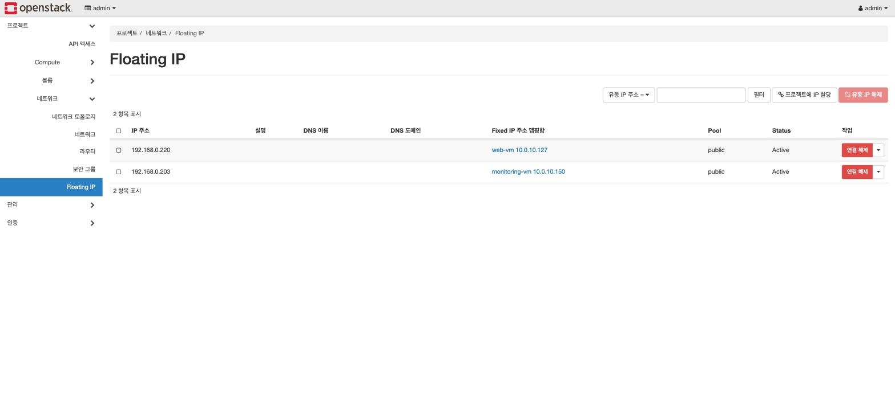
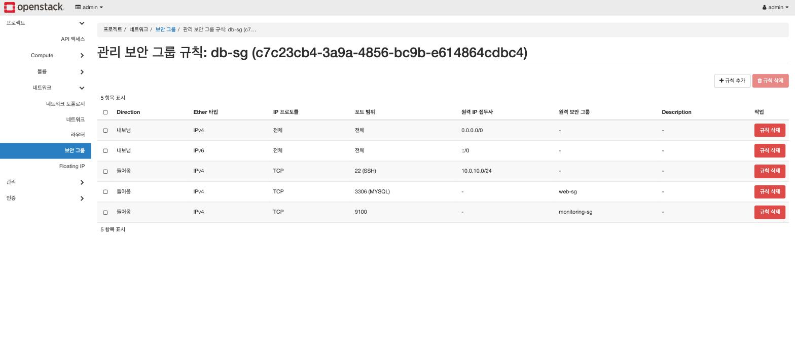
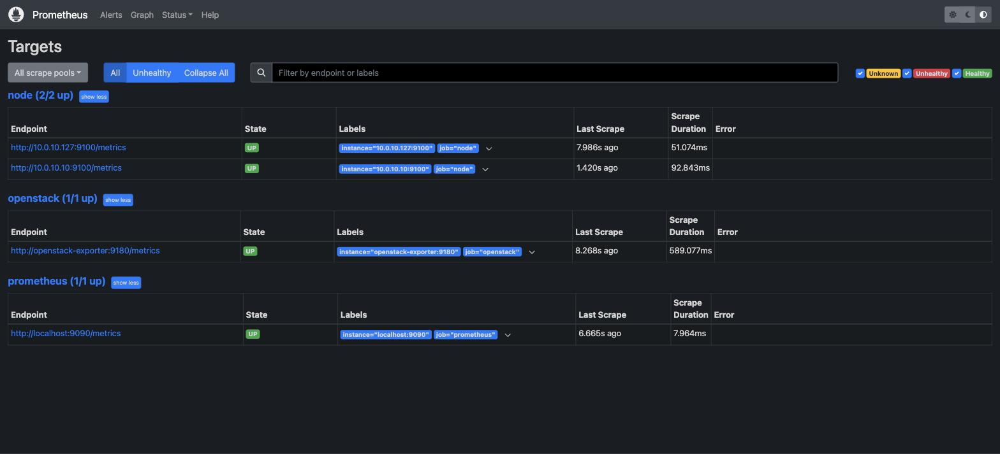
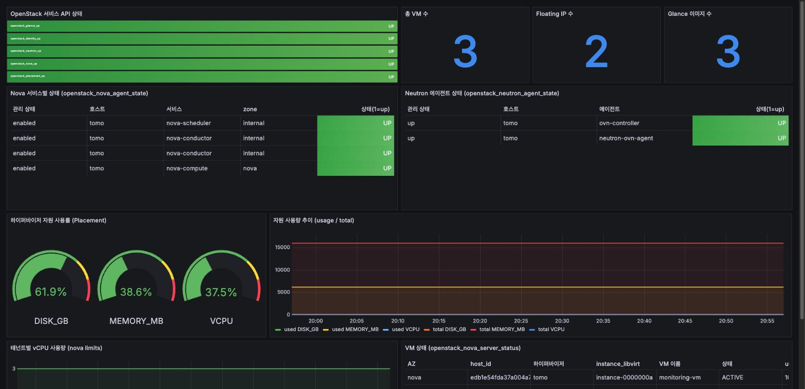
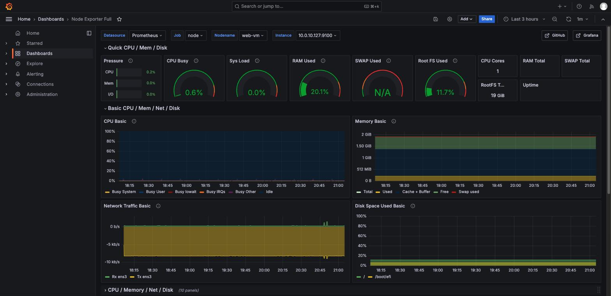

# 3. 검증

"apply가 끝났다"와 "서비스가 동작한다"는 다르다. 여기서 확인하는 것은 넷이다.

```bash
./scripts/99-verify.sh
```

| 확인 | 증명하는 것 |
|---|---|
| VM 3대 ACTIVE | Nova가 web/db/monitoring을 실제로 띄웠다 |
| `db-data` 볼륨 `in-use` | Cinder 볼륨이 db-vm에 붙어 있다 = DB 데이터가 볼륨 위에 있다 |
| Floating IP 2개만 연결 | web/monitoring만 외부에 노출됐다 = db-vm은 밖에서 안 보인다 |
| `http://<web FIP>` 응답에 `Board` | 게시판이 MySQL과 통신하며 실제로 서비스 중이다 |

하나라도 실패하면 exit 1이다.

---

## 3.1 인프라

**네트워크 토폴로지** — 내부망·라우터·VM 3대의 연결 구조. 아키텍처 도식의 실물이다.


**인스턴스 목록** — 3대 모두 ACTIVE. web/monitoring에만 Floating IP가 붙어 있다.


**Floating IP** — db-vm에는 없다. 이것이 private 경계다.



노트북에서 db-vm 내부 IP로 `ping 10.0.10.10`을 쏘면 **timeout이 나는 것이 정상**이다.
라우팅도 Floating IP도 없으므로 LAN에서 도달할 방법이 없다.

**db-sg 규칙** — 3306의 출발지가 IP가 아니라 web-sg 그룹이다.



**Cinder 볼륨** — `db-data`가 `in-use`. db-vm 안에서 `df -h /var/lib/mysql`을 보면
`/dev/vdb` 위에 마운트돼 있다.


## 3.2 서비스

노트북 브라우저에서 web-vm의 Floating IP로 접속해 글을 쓰고, 목록에 나타나는 것까지 확인한다.
같은 LAN의 다른 기기가 Floating IP로 서비스를 이용하는 최종 시나리오다.


글이 보인다는 것은 web-vm → (internal-net) → db-vm의 MySQL 왕복이 성립했다는 뜻이고,
그 경로는 db-sg의 "web-sg에서 온 3306만 허용" 규칙을 통과한 것이다.

## 3.3 모니터링

**Prometheus targets** — node 잡(web/db) + openstack 잡 전부 UP.



**Grafana — 오퍼레이터 시야.** 서비스 상태와 하이퍼바이저 용량. "이 클라우드에 VM을 몇 대 더
올릴 수 있나"를 보는 화면이다.



**Grafana — 테넌트 시야.** web-vm의 CPU·메모리·디스크. "내 서버가 잘 돌고 있나"를 보는 화면이다.



## 3.4 재현성

IaC의 값어치는 여기서 나온다.

```bash
terraform -chdir=terraform destroy
terraform -chdir=terraform apply
./scripts/99-verify.sh
```

전부 지우고 다시 만들어도 같은 결과가 나온다. VM 한 대만 바꾸고 싶으면 그것만 교체할 수도 있다.

```bash
terraform -chdir=terraform apply -replace='openstack_compute_instance_v2.monitoring'
```

`plan` 출력에 monitoring-vm 재생성만 뜨고 web/db는 그대로다. 수동 구축에서는 불가능한 조작이다.

> 단, **"apply가 성공했다"는 "의도한 변경이 들어갔다"와 다르다.** plan 출력에서 바꾸려던 속성이
> 실제로 diff에 나타나는지 봐야 한다. 아무 diff 없이 replace만 뜬다면 그건 내 수정이 반영되지
> 않았다는 신호다. 실제로 그렇게 한나절을 태웠다.
> [#8](troubleshooting.md#8-openstack-exporter-컨테이너가-아예-뜨지-않음)

---

## 자주 만나는 문제

| 증상 | 우선 확인 |
|---|---|
| Floating IP로 접속 불가 | Security Group 규칙 → `ovs-vsctl show`로 br-ex 연결 → 공유기 AP 격리 |
| VM은 ACTIVE인데 응답 없음 | `openstack console log show web-vm` — cloud-init이 실패했을 수 있다 |
| VM 간 통신이 이유 없이 느림/끊김 | MTU (오버레이 오버헤드로 1450 필요). `ping -M do -s 1422 <상대IP>` |
| 갑자기 서비스/VM 사망 | `dmesg \| grep -i oom`, `df -h` |
| VM에서 apt가 안 됨 | 서브넷의 DNS 설정, 라우터의 external gateway 연결 |

---

전체 장애 기록: [troubleshooting.md](troubleshooting.md)
