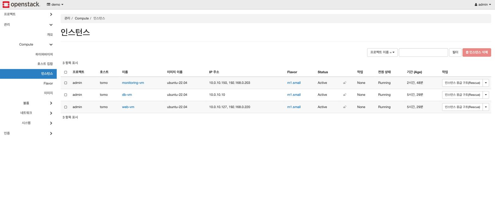
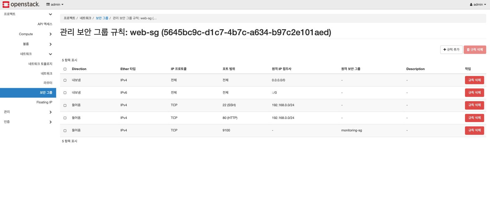
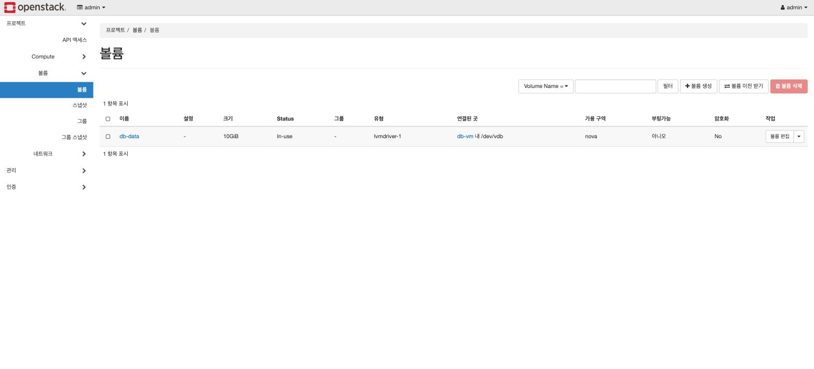

# 5. 검증 — 실제로 동작하는지 확인하기

> "apply가 성공했다"와 "서비스가 동작한다"는 다르다. 각 구성 요소가 **설계한 대로** 동작하는지,
> 그리고 **막아야 할 것이 실제로 막히는지**를 확인한다. 화면은 [`images/`](images)에 있다.

---

## 5-1. 리소스가 존재하는가

```bash
openstack server list        # web/db/monitoring 3대가 ACTIVE인지 + 각자의 내부 IP
openstack volume list        # db-data 볼륨이 in-use(부착됨) 상태인지
openstack floating ip list   # Floating IP가 web-vm과 monitoring-vm에만 붙어 있는지 — db-vm에는 없어야 한다
```

Horizon의 **네트워크 토폴로지** 화면이 이 구조를 한 장으로 보여준다 — 내부망, 라우터, VM 3대의
연결 관계.




## 5-2. 서비스가 동작하는가

노트북(다른 기기) 브라우저에서 `http://<web-vm Floating IP>`로 접속해 글을 쓴다.
글이 목록에 나타나면 **web-vm → db-vm 경로가 살아 있다는 뜻**이다. 게시판 앱은 매 요청마다
db-vm의 MySQL에 접속하므로, 화면이 뜬다는 것 자체가 2-tier 연결의 증거다.


## 5-3. 막아야 할 것이 막히는가

private 경계는 "열린 것"이 아니라 "닫힌 것"으로 증명된다.

```bash
# (노트북에서) db-vm의 내부 IP로 ping → 실패(timeout)해야 정상
ping 10.0.10.10
```

db-vm은 Floating IP가 없으므로 외부에서 도달 경로 자체가 없다. Security Group 규칙도 함께
확인한다 — web-sg는 LAN에서 22/80만, db-sg는 web-sg 소속에서 3306만.



## 5-4. 데이터가 볼륨 위에 있는가

```bash
# (db-vm 안에서) 데이터 디렉토리가 /dev/vdb 위에 마운트됐는지
df -h /var/lib/mysql
```

Horizon에서도 `db-data` 볼륨이 `in-use`로 db-vm에 붙어 있음을 확인할 수 있다.
**MySQL 데이터가 VM의 루트 디스크가 아니라 이 볼륨 위에 있다**는 것이, VM을 지워도 데이터가
남는 구조의 근거다.



## 5-5. 관측이 되는가

```bash
terraform output prometheus_url   # http://<monitoring FIP>:9090
terraform output grafana_url      # http://<monitoring FIP>:3000
```

Prometheus `/targets`에서 잡 3개(prometheus / node / openstack)가 전부 UP이면 수집 성공.
Docker 이미지 pull 때문에 게시판보다 몇 분 더 걸릴 수 있다.


Grafana에서 오퍼레이터 시야 대시보드 — 서비스 API 상태, nova/neutron 에이전트 상태,
Placement 사용률.


## 5-6. 재현되는가 — IaC의 최종 확인

```bash
terraform destroy
terraform apply
curl http://$(terraform output -raw web_floating_ip)/    # 동일하게 동작하면 성공
```

Floating IP는 재할당 시 이전과 다를 수 있다. 정상이다 — 그래서 주소를 사람이 기억하지 않고
`terraform output`으로 읽는다.

## 자주 만나는 문제

| 증상 | 우선 확인 |
|---|---|
| 노트북에서 Floating IP 접속 불가 | Security Group 규칙 → br-ex 연결(`ovs-vsctl show`) → 공유기 AP 격리 |
| 갑자기 서비스/VM 죽음 | `dmesg \| grep -i oom` (메모리 부족 OOM Killer), `df -h` (디스크 풀) |
| curl은 되는데 브라우저만 안 됨 | 공유기 AP 격리, 또는 노트북이 다른 서브넷 |

**다음**: [트러블슈팅 기록](troubleshooting.md)
